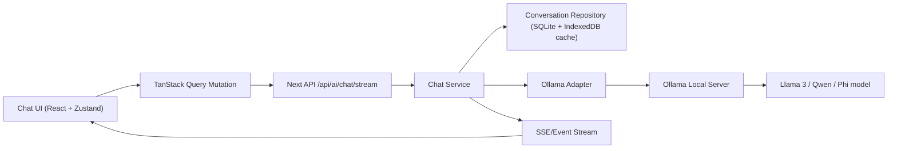
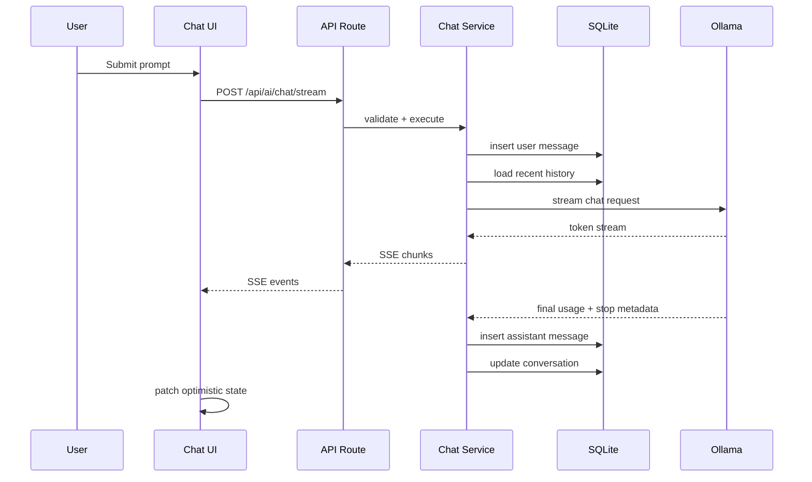
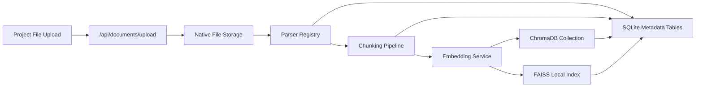
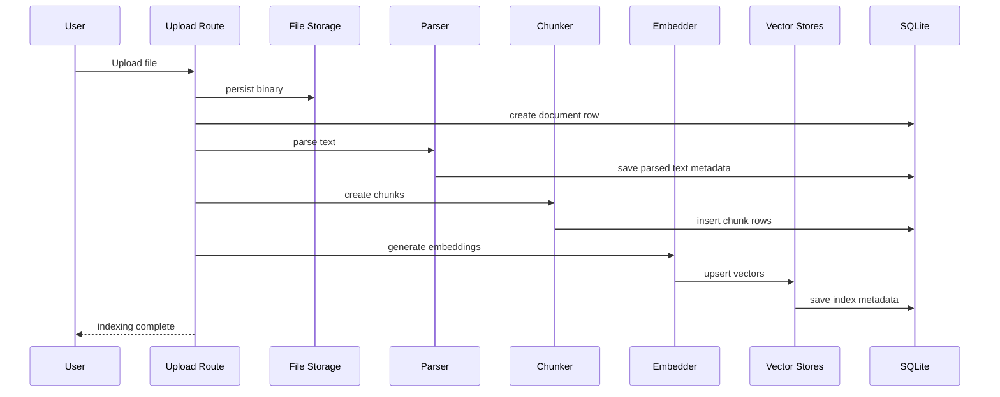
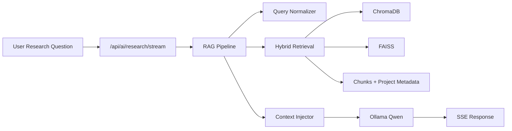
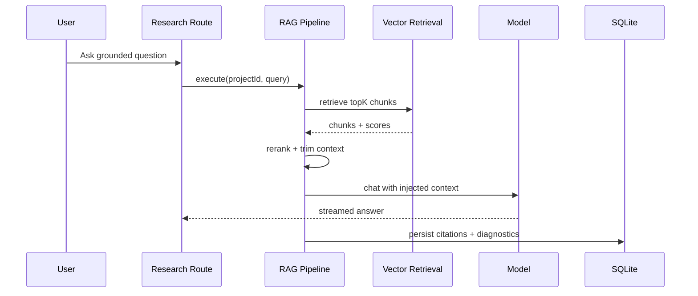
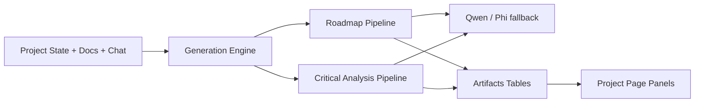
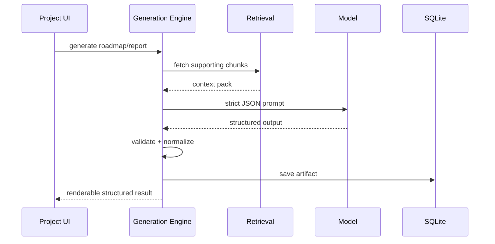

# Vyrix AI Subsystem Implementation Roadmap

This document is written for contributors building the AI subsystem inside a Next.js 15 App Router codebase with Electron desktop packaging.

## 1. Implementation Order

Build in this order because each later phase depends on stable contracts from earlier work:

1. `Phase 1`: local model runtime, chat transport, streaming, conversations
2. `Phase 2`: workspace context, document upload, PDF/image parsing, chunking, embeddings, vector indexes
3. `Phase 3`: retrieval orchestration, context injection, research assistant behaviors
4. `Phase 4`: roadmap generation and critical analysis engines

Why this order is correct:

- Chat without retrieval lets us validate the local inference runtime early.
- Streaming and conversations must be stable before UI teams wire the assistant.
- Retrieval depends on workspace, PDF, and image ingestion quality, not the other way around.
- Roadmap and analysis engines are prompt- and workflow-level products built on top of chat + RAG.

## 2. Target Module Boundaries

```text
src/
  app/
    api/
      ai/
      documents/
      projects/
  features/
    ai/
      contracts/
      prompts/
      state/
      ui/
    documents/
      contracts/
      ui/
    projects/
      contracts/
      ui/
  server/
    ai/
      adapters/
      services/
      repositories/
      pipelines/
      prompts/
      validators/
    documents/
      parsers/
      chunking/
      embeddings/
      indexing/
      storage/
    db/
      sqlite/
      mongo/
  lib/
    electron/
    indexeddb/
    observability/
```

Rules:

- `features/*/contracts` contains shared request/response types consumed by UI and routes.
- `server/ai/adapters` wraps third-party systems like Ollama, ChromaDB, and FAISS.
- `server/ai/services` contains business use cases.
- `server/ai/pipelines` contains multi-step orchestration, especially RAG and document ingestion.
- `server/db/sqlite` owns local-first persistence for conversations, documents, chunks, and index metadata.
- `server/db/mongo` is only for cloud auth/session/usage telemetry and must stay non-critical for offline behavior.

## 3. Phase 1: Ollama Integration, Local Llama 3 Inference, Chat API, Streaming, Conversation Management

### Goal

Ship a reliable local chat runtime that works fully offline after model installation.

### Architecture Diagram



### Folder Structure

```text
src/
  app/
    api/
      ai/
        chat/
          route.ts
          stream/
            route.ts
        conversations/
          route.ts
          [conversationId]/
            route.ts
            messages/
              route.ts
  features/
    ai/
      contracts/
        chat.ts
      state/
        conversation-store.ts
  server/
    ai/
      adapters/
        ollama-client.ts
      repositories/
        conversation-repository.ts
      services/
        chat-service.ts
      validators/
        chat-schemas.ts
    db/
      sqlite/
        schema.sql
```

### Required Packages

Runtime:

- `zod`
- `better-sqlite3`
- `nanoid`
- `eventsource-parser`
- `dexie`
- `zustand`
- `@tanstack/react-query`

Dev/Test:

- `vitest`
- `@vitest/coverage-v8`
- `msw`
- `tsx`
- `typescript`
- `eslint`

Optional but useful:

- `pino`
- `pino-pretty`
- `neverthrow`

### TypeScript Interfaces

See:

- [src/features/ai/contracts/chat.ts](/C:/Users/swarn/OneDrive/Documents/Vyrix/src/features/ai/contracts/chat.ts)
- [src/server/ai/validators/chat-schemas.ts](/C:/Users/swarn/OneDrive/Documents/Vyrix/src/server/ai/validators/chat-schemas.ts)

### API Routes

`POST /api/ai/chat`

- Purpose: synchronous non-streaming completion
- Body: `CreateChatCompletionRequest`
- Response: `CreateChatCompletionResponse`

`POST /api/ai/chat/stream`

- Purpose: token streaming for assistant responses
- Body: `CreateChatCompletionRequest`
- Response: `text/event-stream`

`GET /api/ai/conversations?projectId=:id`

- Purpose: list conversations for project/workspace

`POST /api/ai/conversations`

- Purpose: create a conversation shell before first message

`GET /api/ai/conversations/:conversationId`

- Purpose: fetch conversation metadata and message list

`POST /api/ai/conversations/:conversationId/messages`

- Purpose: append user message, generate assistant message, persist both

### Data Flow

1. UI creates or resumes a conversation.
2. User submits a message with `projectId`, `conversationId`, and selected model.
3. Route validates request with `zod`.
4. `ChatService` persists the user message in SQLite.
5. `ChatService` hydrates recent conversation history.
6. `OllamaClient` calls local Ollama `POST /api/chat`.
7. Streamed tokens are forwarded to UI as SSE.
8. Final assistant message is persisted with token counts and latency metadata.
9. IndexedDB mirrors the latest conversation state for offline UI continuity.

### Sequence Diagram



### Example Implementation Notes

- Use Ollama's chat API rather than generate API so role metadata stays explicit.
- Save messages separately from conversations. Do not store giant JSON blobs per conversation row.
- Persist the assistant message only after the stream completes, but persist the user message before inference begins.
- Include `requestId` on every inference for logging and replay.
- Keep provider abstraction generic enough to support Llama 3, Qwen, and Phi models through Ollama.
- Inject a research-assistant system prompt before chat history so the local model behaves like a PhD/research student assistant.
- Treat workspace excerpts, PDF chunks, OCR text, and image summaries as explicit context. Do not imply that raw files were read unless their extracted context is present.

### Testing Strategy

Unit:

- request validation
- prompt assembly
- conversation repository CRUD
- model capability resolution

Integration:

- mock Ollama streaming with `msw`
- verify SSE chunk format
- verify final message persistence
- verify retry behavior when Ollama is unavailable

Manual:

- cold start without Ollama running
- model missing locally
- multi-turn chat with large history truncation
- offline desktop startup with cached conversation list

### Common Mistakes

- Binding UI directly to Ollama response shapes
- Keeping message state only in React memory
- Failing to cap history by tokens before prompt assembly
- Blocking the route until the whole model response completes
- Treating SQLite as optional for conversation durability

### Git Commit Breakdown

1. `feat(ai): add shared chat contracts and zod validation`
2. `feat(ai): add sqlite conversation schema and repository`
3. `feat(ai): add ollama adapter for chat and streaming`
4. `feat(ai): add app router chat and conversation api routes`
5. `test(ai): add phase 1 unit and integration coverage`

## 4. Phase 2: File Upload Pipeline, Parsing, Chunking, Embeddings, ChromaDB, FAISS

### Goal

Create a deterministic local ingestion pipeline that turns project files into searchable vectors.

### Architecture Diagram



### Folder Structure

```text
src/
  app/
    api/
      documents/
        upload/
          route.ts
        [documentId]/
          parse/
            route.ts
          index/
            route.ts
          chunks/
            route.ts
          retrieve/
            route.ts
  features/
    documents/
      contracts/
        documents.ts
  server/
    documents/
      parsers/
        parser-registry.ts
        pdf-parser.ts
        docx-parser.ts
        markdown-parser.ts
        text-parser.ts
      chunking/
        chunker.ts
      embeddings/
        embedding-service.ts
      indexing/
        chroma-repository.ts
        faiss-repository.ts
        ingest-pipeline.ts
      storage/
        project-file-store.ts
```

### Required Packages

- `pdf-parse` or a higher-quality local PDF parser
- `mammoth`
- `langchain-textsplitters` or a custom splitter
- `chromadb`
- `faiss-node` or a native-side FAISS wrapper used by Electron
- `mime`
- `hash-wasm`

Recommendation:

- Use a custom chunker instead of pulling in all of LangChain. Keep chunking deterministic and inspectable.

### TypeScript Interfaces

See:

- [src/features/ai/contracts/documents.ts](/C:/Users/swarn/OneDrive/Documents/Vyrix/src/features/ai/contracts/documents.ts)

### API Routes

`POST /api/documents/upload`

- multipart upload
- writes file to local project storage
- creates `documents` row with `status=uploaded`

`POST /api/documents/:documentId/parse`

- extracts plain text and structural metadata

`POST /api/documents/:documentId/index`

- generates chunks, embeddings, Chroma records, FAISS entries

`GET /api/documents/:documentId/chunks`

- inspect chunk boundaries for debugging

`POST /api/documents/:documentId/retrieve`

- test retrieval against a single document during development

### Data Flow

1. Upload file to project storage directory.
2. Calculate SHA-256 hash for dedupe.
3. Insert document metadata row.
4. Parser registry selects parser by MIME and extension.
5. Normalize extracted text into canonical document content.
6. Chunk deterministically with overlap and heading awareness.
7. Generate embeddings locally.
8. Persist chunk rows in SQLite.
9. Upsert vectors into Chroma and FAISS.
10. Save index metadata and ingestion status.

### Sequence Diagram



### Example Implementation Notes

- Store the source file and parsed text separately.
- Track parser version and chunker version on every document. Re-index becomes impossible to manage without version fields.
- ChromaDB should hold portable semantic search records; FAISS should be treated as the performance index.
- Use stable chunk IDs: `docId:chunkIndex:contentHashPrefix`.

### Testing Strategy

Unit:

- parser registry routing
- chunk boundary stability
- dedupe hash generation
- embedding batch partitioning

Integration:

- parse and index fixture PDF, DOCX, TXT, MD
- verify vector counts match chunk counts
- verify re-index replaces outdated chunks cleanly

Manual:

- large PDF ingestion
- malformed document handling
- duplicate file upload to same project

### Common Mistakes

- Embedding whole documents instead of chunks
- Ignoring OCR gaps or empty parse results
- Coupling parsing directly to route handlers
- Using only Chroma or only FAISS when both are already architectural requirements

### Git Commit Breakdown

1. `feat(documents): add upload contracts and sqlite document schema`
2. `feat(documents): add parser registry and text extraction`
3. `feat(documents): add deterministic chunking pipeline`
4. `feat(documents): add local embedding service and batching`
5. `feat(documents): add chroma and faiss indexing adapters`
6. `test(documents): cover upload, parse, and indexing flows`

## 5. Phase 3: RAG Pipeline, Context Injection, Research Assistant

### Goal

Make project-aware answers grounded in local documents and workspace state.

### Architecture Diagram



### Folder Structure

```text
src/
  app/
    api/
      ai/
        research/
          route.ts
          stream/
            route.ts
  server/
    ai/
      pipelines/
        rag-pipeline.ts
      services/
        retrieval-service.ts
        research-assistant-service.ts
      prompts/
        research-system-prompt.ts
        citation-prompt.ts
```

### Required Packages

- reuse Phase 1 and 2 packages
- optional reranker package if a lightweight local reranker is later added

### TypeScript Interfaces

See:

- [src/features/ai/contracts/rag.ts](/C:/Users/swarn/OneDrive/Documents/Vyrix/src/features/ai/contracts/rag.ts)

### API Routes

`POST /api/ai/research`

- non-streaming grounded answer

`POST /api/ai/research/stream`

- streaming grounded answer with citations

### Data Flow

1. Accept research question plus `projectId`.
2. Normalize the query for retrieval.
3. Generate query embedding.
4. Retrieve top-k from Chroma and FAISS.
5. Merge, dedupe, rerank, and cap by token budget.
6. Build grounded system prompt and citation envelope.
7. Stream answer from Qwen.
8. Persist answer, citations, and retrieval diagnostics.

### Sequence Diagram



### Example Implementation Notes

- Put citations in a machine-readable response block, not just prose.
- Include `retrievalTrace` in debug mode to inspect why bad answers happened.
- Hard-cap injected chunks by token budget, not by count alone.

### Testing Strategy

Unit:

- retrieval merge and dedupe
- citation mapping
- context budget trimming

Integration:

- seeded document corpus with expected answer/citation assertions
- degraded retrieval fallback when no chunks are found

Manual:

- cross-document research query
- ambiguous query needing follow-up
- very large project corpus

### Common Mistakes

- Injecting raw top-k blindly
- Skipping retrieval diagnostics
- Letting prompt templates drift from response contracts

### Git Commit Breakdown

1. `feat(rag): add retrieval contracts and diagnostics types`
2. `feat(rag): add hybrid retrieval service and context budgeter`
3. `feat(rag): add research assistant routes and prompts`
4. `test(rag): add grounded-answer integration fixtures`

## 6. Phase 4: Roadmap Generation Engine, Critical Analysis Engine

### Goal

Turn grounded project knowledge into structured outputs users can act on.

### Architecture Diagram



### Folder Structure

```text
src/
  app/
    api/
      ai/
        roadmap/
          route.ts
        analysis/
          route.ts
  server/
    ai/
      services/
        roadmap-service.ts
        critical-analysis-service.ts
      prompts/
        roadmap-prompt.ts
        critical-analysis-prompt.ts
      pipelines/
        roadmap-pipeline.ts
        analysis-pipeline.ts
```

### Required Packages

- reuse prior phases
- optionally `jsonrepair` for sanitizing malformed model JSON

### TypeScript Interfaces

See:

- [src/features/ai/contracts/analysis.ts](/C:/Users/swarn/OneDrive/Documents/Vyrix/src/features/ai/contracts/analysis.ts)

### API Routes

`POST /api/ai/roadmap`

- generate structured roadmap from project prompt + project corpus

`POST /api/ai/analysis`

- generate critical analysis report with risks, contradictions, and evidence

### Data Flow

1. Gather project brief, uploads, and prior conversation summaries.
2. Run retrieval against relevant files.
3. Build strict JSON-output prompt.
4. Generate model response.
5. Validate against `zod` schema.
6. Persist generated artifact and source citations.

### Sequence Diagram



### Example Implementation Notes

- Treat roadmap and analysis outputs as versioned artifacts, not just chat messages.
- Use strict schemas with validation retries for structured generation.
- Critical analysis should explicitly separate evidence-backed issues from model inference.

### Testing Strategy

Unit:

- schema validation
- artifact normalization
- prompt section builders

Integration:

- golden fixtures for roadmap and analysis outputs
- validation retry path

Manual:

- weak project prompt
- contradictory source documents
- low-resource device using smaller Phi fallback

### Common Mistakes

- Returning free-form markdown when the UI needs structured JSON
- Failing to preserve citations for generated action items
- Mixing roadmap drafts into conversation history instead of artifact storage

### Git Commit Breakdown

1. `feat(ai): add roadmap and analysis artifact contracts`
2. `feat(ai): add structured generation services`
3. `feat(ai): add roadmap and analysis routes`
4. `test(ai): add artifact validation and generation fixtures`

## 7. Database Schemas

Local SQLite is the source of truth for offline AI data:

- `projects`
- `conversations`
- `messages`
- `documents`
- `document_chunks`
- `embedding_jobs`
- `vector_indexes`
- `generated_artifacts`

Cloud MongoDB should remain minimal:

- `users`
- `sessions`
- `usage_events`

See:

- [src/server/db/sqlite/schema.sql](/C:/Users/swarn/OneDrive/Documents/Vyrix/src/server/db/sqlite/schema.sql)
- [src/server/db/mongo/usage-event.schema.ts](/C:/Users/swarn/OneDrive/Documents/Vyrix/src/server/db/mongo/usage-event.schema.ts)

## 8. Recommended First Module

Build `Phase 1` first, specifically in this order:

1. shared chat contracts
2. SQLite conversation schema
3. Ollama adapter
4. streaming chat route
5. conversation list/detail routes

This is the highest engineering value because it de-risks:

- local model process communication
- streaming UI integration
- offline persistence
- provider abstraction for Qwen and Phi

## 9. Contributor Task Board

These tasks are intentionally independent and mergeable:

### Phase 1

- Add chat request/response contracts and zod schemas
- Implement SQLite migration for conversations and messages
- Implement `OllamaClient.chat()` and `OllamaClient.streamChat()`
- Add `POST /api/ai/chat`
- Add `POST /api/ai/chat/stream`
- Add conversation list/create/detail/message routes
- Add Vitest coverage for request validation and streaming

### Phase 2

- Add document metadata schema and upload route
- Implement parser registry with TXT, MD, PDF, DOCX support
- Implement deterministic chunker
- Implement local embedding service
- Add Chroma adapter
- Add FAISS adapter
- Add indexing route and fixtures

### Phase 3

- Implement hybrid retrieval service
- Implement RAG prompt builder with citations
- Add research assistant streaming route
- Add retrieval diagnostics persistence

### Phase 4

- Add roadmap generation schema and route
- Add critical analysis schema and route
- Add artifact versioning and citation persistence

## 10. Definition of Done by Phase

### Phase 1 DoD

- local chat works with installed Qwen model
- responses stream token-by-token
- conversations persist across app restarts
- missing Ollama/model errors are actionable

### Phase 2 DoD

- supported files can be uploaded, parsed, chunked, embedded, and indexed locally
- re-indexing is deterministic

### Phase 3 DoD

- research assistant answers include relevant citations from project documents

### Phase 4 DoD

- roadmap and analysis outputs are structured, validated, persistent artifacts
